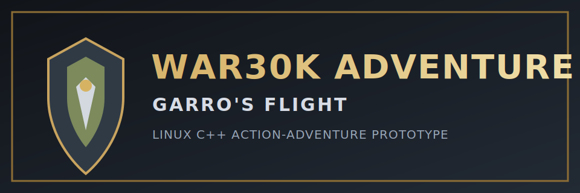
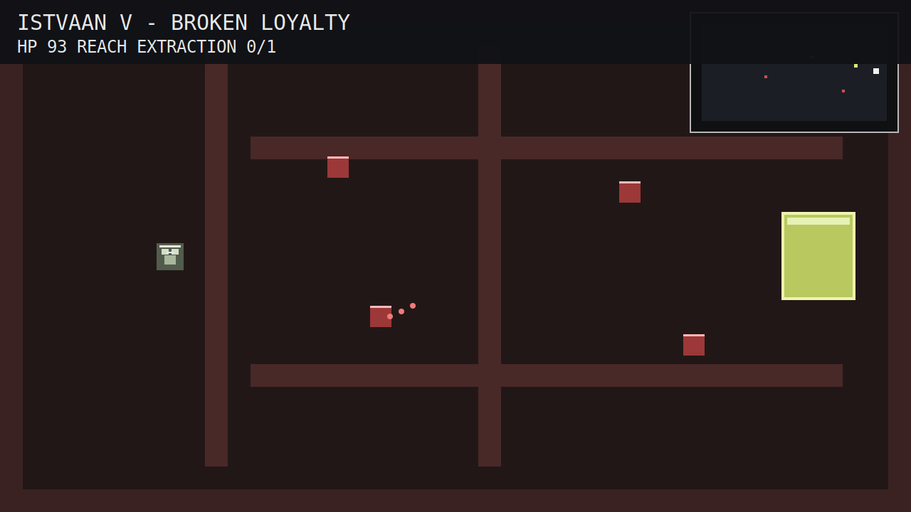
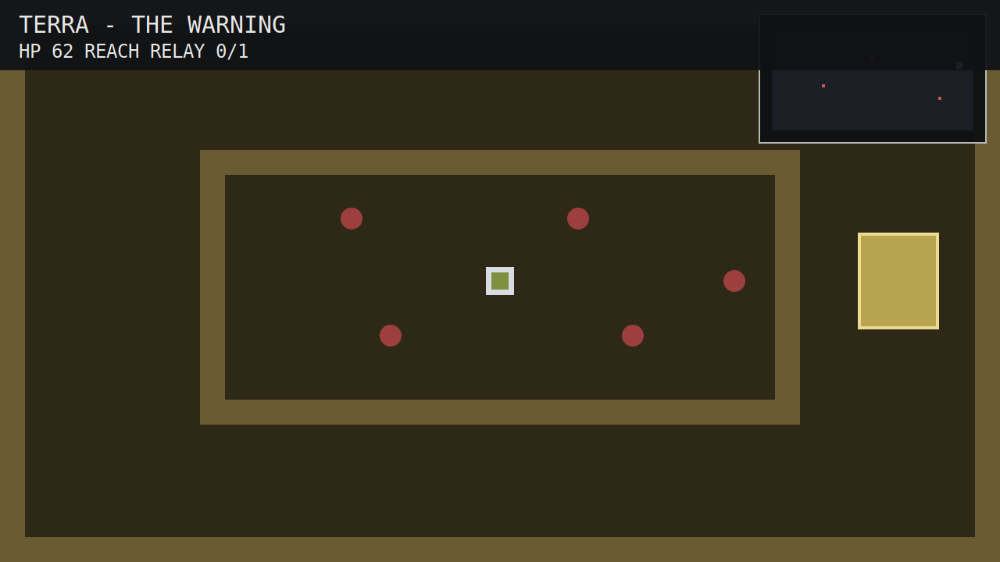

# WAR30K ADVENTURE: GARRO'S FLIGHT




Linux-native top-down action-adventure RPG prototype in C++/SDL2.

You play as Nathaniel Garro during the Horus Heresy, surviving Isstvan V, crossing the warp, breaking the Luna approach blockade, and reaching Terra to deliver warning of Horus' betrayal.

## Gameplay Overview

- Genre: top-down action-adventure (classic 16-bit style flow)
- Platform target: Linux
- Input: keyboard + game controller
- Campaign: 4 connected story stages with objectives and narrative panels
- Combat: melee attack arc + enemy ranged projectiles
- Combat: Player sword swing arc with knockback-driven hit response
- Tactical UI: objective tracking, HP HUD, and minimap
- Animation: JSON-driven spritesheets with 8-direction state switching (`Idle` / `Walk`)
- Player system: ALttP-style 4-direction sprite state (`Up/Down/Left/Right`) and sword state
- Enemy AI: Zelda-style wander + aggro behavior with distance-triggered pursuit
- Legion palette swaps: dynamic texture tinting (e.g., Emperor's Children, World Eaters)
- Visual style: procedural edge-highlighting pass for top armor edges (30K 'Eavy Metal-inspired)

## Story Campaign

1. **Isstvan V – Broken Loyalty**
	- Escape the Drop Site massacre and reach extraction.
2. **Warp Crossing – The Eisenstein**
	- Stabilize warp wards by activating beacon relics.
3. **Luna Approach – Blockade Run**
	- Purge traitor boarding forces to open a corridor.
4. **Terra – The Warning**
	- Reach the relay and send warning to the Emperor.

## Screenshots / Images



_Current build: Garro sword arc strike with knockback response, projectile pressure, and active minimap contacts._



_Current build: mixed legion palette variants, aggro pursuit states, and objective relay approach under fire._

## Controls

### Keyboard

- Move: `W A S D` or Arrow Keys
- Attack: `Space` or `J`
- Interact / Continue: `E` or `Enter`
- Restart after win/loss: `R`
- Quit: `Esc`

### Controller

- Move: Left Stick
- Attack: `A` (or Right Trigger)
- Interact / Continue: `X` or `B`

## Tech Stack

- Language: C++17
- Rendering/Input: SDL2
- Build system: CMake

## Modular Project Structure

```text
include/
  animated_sprite.hpp    # JSON spritesheet animator with setAnimation(state, direction)
  core_types.hpp        # Shared constants, data structs, enums, math signatures
  enemy.hpp             # Enemy base class, Zelda-style AI, palette swaps, knockback
  font.hpp              # Bitmap font interface
  player.hpp            # Garro player class with SpriteState and sword arc collision
  world.hpp             # Stages, map generation, collision
  render.hpp            # Sprite/tile/minimap rendering
  game.hpp              # Game class interface

src/
  main.cpp              # Thin launcher
  game.cpp              # Core loop, state machine, gameplay systems
  core/
    animated_sprite.cpp # AnimatedSprite implementation (JSON + frame timing + motion overlays)
    common.cpp          # Math + bitmap font implementation
    enemy.cpp           # Enemy AI implementation (wander/aggro + knockback + palette)
    player.cpp          # Player implementation (4-dir render + sword swing arc)
    world.cpp           # Stage data + map/collision implementation
    render.cpp          # Tile/sprite/minimap drawing implementation

assets/
  garro_sheet.bmp       # Procedural Garro spritesheet
  garro_frames.json     # Garro frame definitions
  sample_frames.json    # Generic sample frame map for sprite animation reference
  traitor_sheet.bmp     # Procedural traitor spritesheet
  traitor_frames.json   # Traitor frame definitions

scripts/
  generate_sheets.py    # Procedural spritesheet generator with edge highlights
```

## Performance Notes (Modular + Fast)

- Split into translation units to reduce incremental build time and improve code locality.
- Data-oriented containers (`std::vector`) for enemies/projectiles/beacons.
- `reserve()` used for hot-path entity vectors to reduce runtime reallocations.
- Fixed-size tile grid with lightweight collision checks.
- Frame delta clamping to avoid simulation spikes.
- Animation work moved into dedicated module to reduce game-loop complexity.
- Runtime enemy behavior moved to reusable Enemy base classes.
- Knockback overlap resolution prevents enemy/player collision stacking.
- Rendering combines tile primitives with sprite-sheet blits for low overhead.

## Linux Setup

### Dependencies

- `g++` or `clang++` with C++17 support
- `cmake` (3.16+)
- SDL2 development package

Debian/Ubuntu example:

```bash
sudo apt-get update
sudo apt-get install -y build-essential cmake libsdl2-dev
```

## Build

```bash
cmake -S . -B build
cmake --build build -j
```

## Regenerate Spritesheets (Optional)

The project includes procedural spritesheet generation with top-edge armor highlights (30K style edge-lighting pass):

```bash
python3 scripts/generate_sheets.py
```

This regenerates:

- `assets/garro_sheet.bmp`
- `assets/traitor_sheet.bmp`

## AnimatedSprite JSON Format

`AnimatedSprite` expects keys in this pattern:

- `Idle_0` ... `Idle_7`
- `Walk_0` ... `Walk_7`

Direction indices:

- `0=N`, `1=NE`, `2=E`, `3=SE`, `4=S`, `5=SW`, `6=W`, `7=NW`

Frame objects use:

```json
{ "x": 64, "y": 96, "w": 32, "h": 32, "duration": 95 }
```

Animation behavior:

- `Idle`: subtle breathing shoulder-pad drift.
- `Walk`: heavy 4-frame stomp cadence.

## Run

```bash
./build/war30k_adventure
```

## Changelog

See [CHANGELOG.md](CHANGELOG.md) for release history.

## Disclaimer

This is a fan-made, non-commercial prototype inspired by the Warhammer 30K setting.

